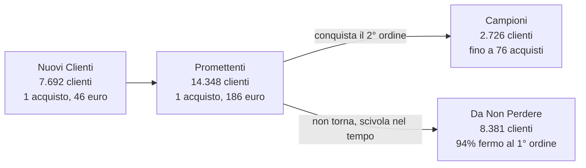

# Confronto tra Segmenti, Analisi RFM Pellizzari

Documento di sintesi della Fase 2 del progetto, il confronto incrociato tra i segmenti Nuovi Clienti, Promettenti, Campioni e Da Non Perdere.

Nota di metodo, tutti i valori economici sono lordi dei resi. Benchmark cliente aggiornato al 20 luglio 2026. La tesi centrale, il valore di Pellizzari si crea o si perde tutto sul secondo acquisto.

## INDICE

1. La mappa del viaggio
2. I quattro segmenti a confronto
3. La vera linea di demarcazione è la frequenza
4. Il primo ordine predice il destino
5. Quando e dove entrano
6. Iscrizione newsletter
7. Dove si crea e dove si perde valore
8. Le differenze che contano

---

## 1. LA MAPPA DEL VIAGGIO

I quattro segmenti non sono categorie separate, sono le tappe di un unico percorso del cliente. Si entra recenti ma senza storia, da lì due strade, salire verso i Campioni conquistando il riacquisto, oppure scivolare verso i Da Non Perdere con il passare del tempo.

Nuovi Clienti e Promettenti condividono la stessa area d'ingresso nella matrice RFM, li separa solo il valore del primo ordine.

---

## 2. I QUATTRO SEGMENTI A CONFRONTO

| Metrica | Nuovi Clienti | Promettenti | Campioni | Da Non Perdere |
|---|---|---|---|---|
| Clienti | 7.692 | 14.348 | 2.726 | 8.381 |
| Fatturato lifetime | € 559 mila | € 2,85 mln | € 2,45 mln | € 1,93 mln |
| Valore medio cliente | € 73 | € 199 | € 900 | € 231 |
| Recency (R medio) | 4,16 | 3,97 | 4,66 | 1,39 |
| Frequenza e valore (F-M medio) | 1,20 | 2,52 | 4,54 | 2,71 |
| Numero acquisti | 1 | 1 | fino a 76 | 1 nel 94% dei casi |
| Scontrino d'ingresso | € 46 | € 186 | € 371 | ~ € 200 |
| Brand d'ingresso n. 1 | Le Papù | Emme Marella | Emme Marella | Le Papù |
| Categoria d'ingresso | Scarpe, Mare | Abbigliamento, Borse | Donna, Outlet | Outlet, Donna |
| Stagione d'ingresso | Estate | Gennaio, Natale | Gennaio | Gennaio |
| Anagrafica mancante | 4,4% | 4,8% | 16,3% | 10,1% |
| Iscritti newsletter | 16,7% | 21,4% | 29,5% | 23,3% |

---

## 3. LA VERA LINEA DI DEMARCAZIONE È LA FREQUENZA

Tre segmenti su quattro vivono di un solo acquisto. L'unico gruppo che riacquista in profondità sono i Campioni, ed è anche l'unico di massimo valore.

| Segmento | Quota che supera il 1° ordine |
|---|---|
| Campioni | il 2° ordine è la norma |
| Da Non Perdere | 6% |
| Promettenti | ~0%, per definizione |
| Nuovi Clienti | ~0%, per definizione |

### Il valore del carrello dei Campioni, per ordine

| Progressivo | Scontrino medio |
|---|---|
| 1° | € 371 |
| 2° | € 578, picco |
| 3° | € 363 |
| 4° | € 277 |
| 5° | € 233 |
| 6° | € 225 |

Il 2° ordine è il picco di spesa, poi il ritmo si stabilizza. Superare la soglia del riacquisto genera il carrello più ricco della relazione.

---

## 4. IL PRIMO ORDINE PREDICE IL DESTINO

Chi diventa Campione entra spendendo circa 371 euro, quasi il doppio di un Promettente e otto volte un Nuovo Cliente.

| Segmento | Scontrino del primo ordine |
|---|---|
| Campioni | € 371 |
| Da Non Perdere | ~ € 200 |
| Promettenti | € 186 |
| Nuovi Clienti | € 46 |

### Il brand d'ingresso come segnale di valore

- Ingresso a basso valore, Le Papù e Havaianas guidano l'acquisizione dei Nuovi Clienti e dei Da Non Perdere, spesso via scarpe e mare in estate.
- Ingresso di valore, Emme Marella, Weekend Max Mara, Mc2 Saint Barth, Pinko e Barbour dominano i Promettenti e i Campioni, con capispalla e abbigliamento premium.
- L'amplificatore di fedeltà, Hlo! è il brand col più alto tasso di riacquisto tra i Campioni, oltre due ordini profondi per ogni primo acquisto.

---

## 5. QUANDO E DOVE ENTRANO

### Stagionalità d'ingresso

Il momento dell'ingresso è legato al valore. Gli ingressi a basso valore si concentrano in estate, trainati da mare e scarpe. Gli ingressi di valore arrivano a gennaio con i saldi e i capispalla, e a dicembre col regalo di Natale. I Campioni, in più, comprano tutto l'anno, con i saldi che pesano solo un quarto del fatturato.

### Geografia, uniforme tra i segmenti

Lombardia, Lazio e Veneto dominano in tutti e quattro i segmenti, valendo insieme circa metà della base, fino al 57,5% tra i Promettenti. I Campioni hanno la peggiore copertura anagrafica, il 16,3% senza regione, un dato da colmare proprio sul segmento più prezioso.

---

## 6. ISCRIZIONE NEWSLETTER

Dato calcolato sull'intera base di 55.687 clienti al 20 luglio 2026.

| Segmento | Tasso di iscrizione | Clienti non iscritti |
|---|---|---|
| Campioni | 29,5%, il più alto tra gli 11 segmenti | 1.921 |
| Da Non Perdere | 23,3% | 6.418 |
| Promettenti | 21,4% | 11.258 |
| Nuovi Clienti | 16,7%, il più basso | 6.403 |
| Media base | 21,6% | |

Anche tra i Campioni, meno di un cliente su tre è iscritto. La leva del secondo acquisto via email oggi raggiunge solo un Promettente su cinque e un Nuovo Cliente su sei.

---

## 7. DOVE SI CREA E DOVE SI PERDE VALORE

### Leva 1, il secondo acquisto

È il bivio che separa i Campioni dai Da Non Perdere. Presidiarlo su Promettenti e Nuovi Clienti è l'attività a più alto potenziale, ma oggi solo un quinto è iscritto alla newsletter, quindi va abbinato alla raccolta consensi.

### Leva 2, la qualità dell'acquisizione

Il valore e il brand del primo ordine predicono il cliente. Orientare acquisizione e merchandising verso gli ingressi premium significa generare più futuri Campioni e meno clienti a basso valore.

### Leva 3, il recupero dei dormienti

I Da Non Perdere valgono 1,93 milioni e hanno lo stesso profilo dei Promettenti. Un win-back tempestivo, prima che diventino Clienti Persi, recupera valore già esistente.

---

## 8. LE DIFFERENZE CHE CONTANO

- Nuovi Clienti e Promettenti sono gemelli separati dal valore d'ingresso, stessa frequenza, stessa recency, stessa area della matrice, cambia solo quanto spendono al primo ordine.
- I Da Non Perdere sono l'ombra dei Promettenti, stesso scontrino, stessa partenza monoacquisto, ma non convertiti e ormai dormienti da 2-3,5 anni.
- I Campioni sono l'unico segmento che riacquista, ed è l'unico di massimo valore, la frequenza, non lo scontrino singolo, costruisce il valore lifetime.
- Il brand d'ingresso è un predittore azionabile, Le Papù porta volume a basso valore, il womenswear Max Mara e i premium portano valore.
- La stagionalità segue il valore, ingressi economici in estate, ingressi di valore a gennaio e Natale.
- La geografia non discrimina il valore, le stesse tre regioni dominano ogni segmento, quindi la leva strategica è comportamentale e di ciclo di vita, non territoriale.

---

*Moca Interactive per Pellizzari, Analisi RFM 2026, Confronto tra segmenti, Fase 2*
